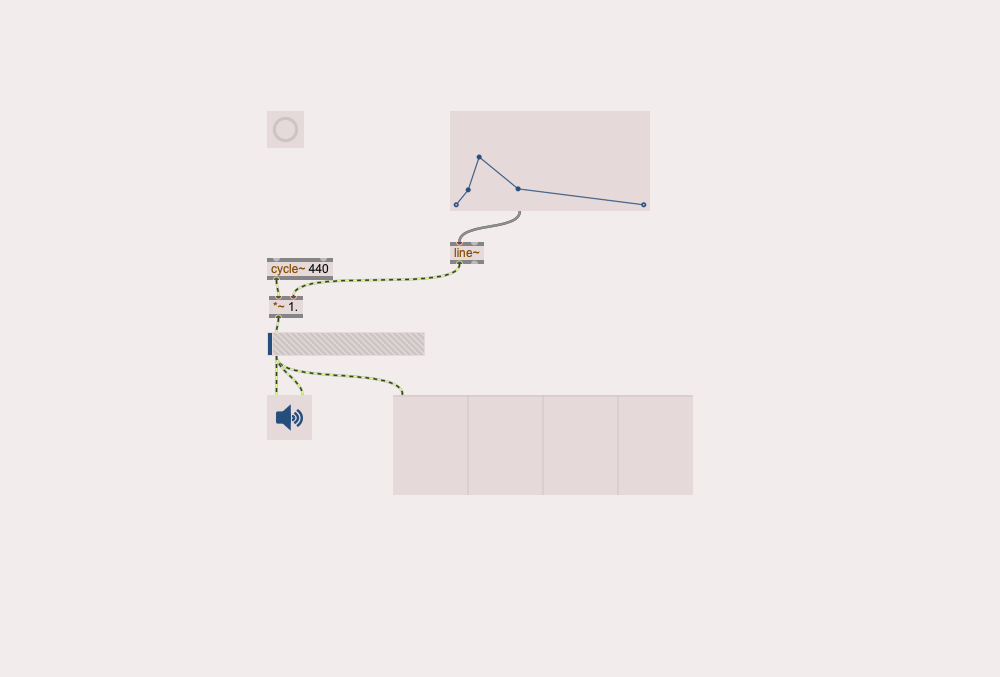

# Max/MSP Assistant

An AI-powered assistant for Max/MSP patch development and optimization.

## Features

- Analyzes Max/MSP patches using LLM technology
- Suggests improvements to patch structure and functionality
- Automatically applies suggested changes to patches
- Handles multiple suggestions with proper index management
- Supports various types of patch improvements:
  - Object additions
  - Connection modifications
  - Parameter optimizations
  - Structure improvements
  - Error fixes

## Setup

1. Clone the repository
2. Copy `.env.example` to `.env` and add your OpenRouter API key:
   ```bash
   cp .env.example .env
   ```
3. Edit `.env` and replace `your_api_key_here` with your actual OpenRouter API key

## Usage

Run the test script to analyze a patch, eg:

```bash
PYTHONPATH=. python tests/test_gemini_pro_analysis.py
```

## Example

Here's a simple example of how the assistant can improve a patch. Given a patch with these objects (indices shown):

```
[0] newobj (obj-6) - *~ 1.
[1] newobj (obj-11) - line~
[2] function (obj-10)
[3] spectroscope~ (obj-9)
[4] gain~ (obj-4)
[5] button (obj-3)
[6] ezdac~ (obj-2)
[7] newobj (obj-1) - cycle~ 440
```

The assistant can suggest connecting the button to the function object:

````
TYPE: CONNECTION_MODIFY
DESCRIPTION: Connect button to function object for amplitude control
REASONING: This allows the button to trigger the function object's amplitude envelope
LOCATION: AFTER 5
CHANGES:
```json
[
  {
    "type": "add_connection",
    "data": {
      "patchline": {
        "source": ["obj-3", 0],
        "destination": ["obj-10", 0]
      }
    }
  }
]
````

## Patch Visualizations

> **Note:** The following examples serve as a proof of concept. While they demonstrate the basic functionality, the current implementation still has room for improvement in terms of patch organization, object positioning, and suggestion quality. 

### Original Test Patch



A simple synthesizer patch that generates a 440Hz tone with amplitude control.

### Gemini Pro Enhanced Version


The patch after Gemini Pro's suggested improvements:

- Added frequency control with kslider and mtof objects
- Modified signal routing for frequency control
- Added initialization message
- Improved object positioning

The patch has some significant pitfalls after Gemini Pro's suggestions:

- Poor object positioning
- Useless objects

Other proof of poor performance (not demonstrated in this example) are suggestions which:

- Fail to connect objects properly
- Leave ill-described comments
- Give (at best) weak/novel improvements

## Development

The project uses:

- Python 3.x
- OpenRouter API for LLM access
- JSON-based Max/MSP patch format

## License

MIT License
